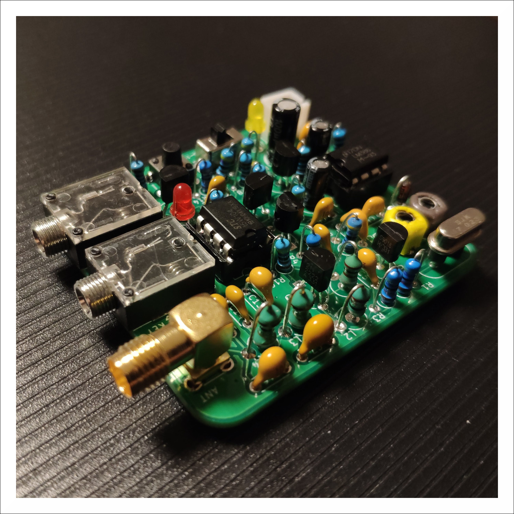
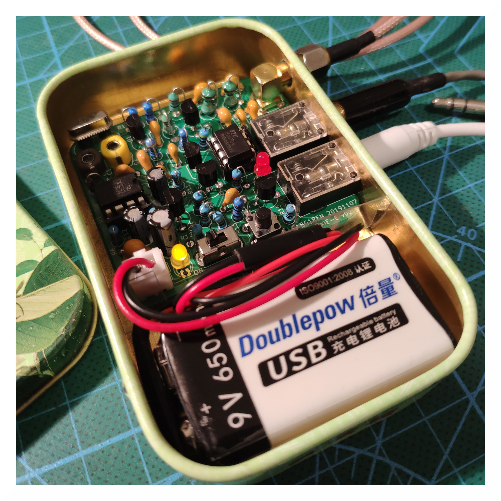
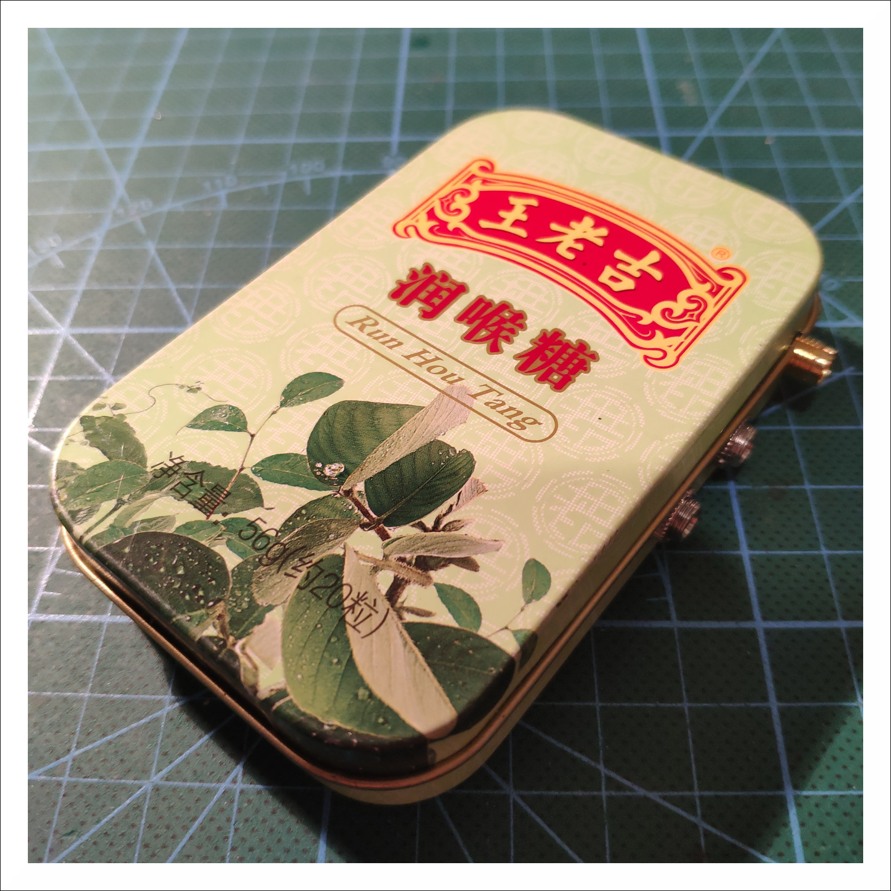
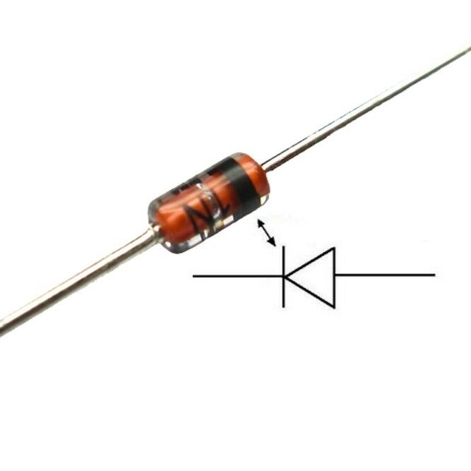
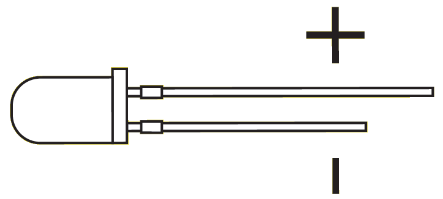
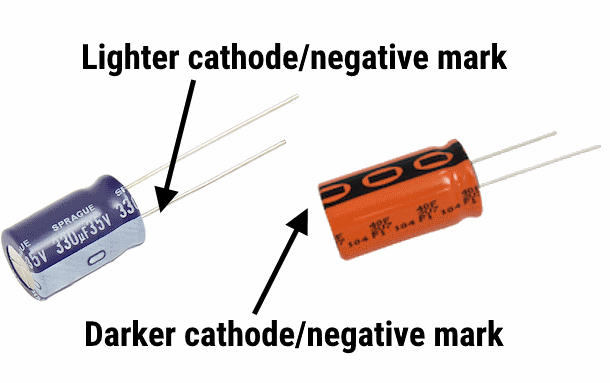
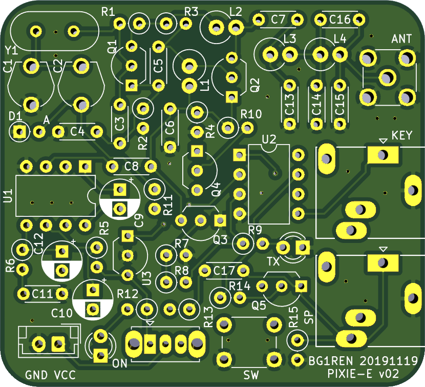
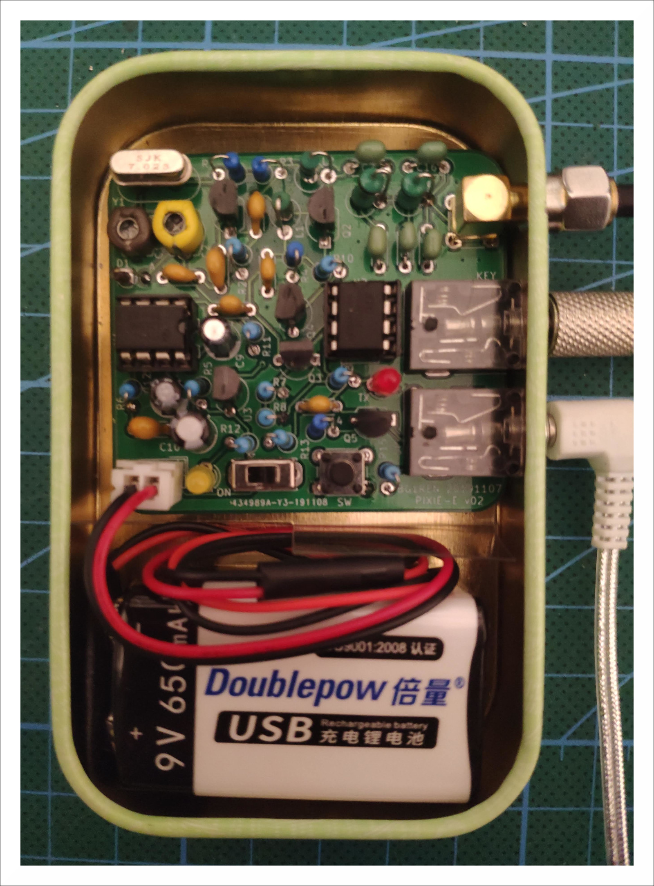

# Pixie-E

Version 02 / BG1REN / 2019-11-21

## 简介

Pixie-E在经典的Pixie QRPP CW电台的基础上，做了些改进：

* 由单片机生成侧音，并增加了静音电路，提升发射时的体验；
* 增加了自动键功能，同时也支持手键；
* 改进了低通滤波器，杂散发射指标优于-40dB。

Pixie-E的电路板大小为5cm x 5.5cm，四个角为圆角，可以和一块9V电池一起安装在润喉糖盒子中。

  
  
  

## 关于元件

### 独石电容的容量

独石电容大多以三位数字表示容量。如果电容上标识的数字是nnm，其容量为：

$$
C = nn \times 10^{m} pF
$$

例如：

* 103： $10 \times 10^3 pF = 10 nF$
* 471： $47 \times 10^1 pF = 470 pF$

容量不到100pF的独石电容，有的以类似100（10p）、220（22p）这样的方式标识，也有的只用两位数字加字母p标识，例如22p、56p等。需要准确辨认。

### DIP-8封装的集成电路的方向

DIP-8封装的集成电路，在管脚1、8的一侧，有一个缺口。这个缺口方向要和电路板上丝印的缺口方向一致。使用集成电路插座时，插座的缺口方向也需要保持一致。

### 二极管的极性

    
    

如图所示，1N4148有环形标识的一侧为负极，另一侧为正极。发光二极管LED的长脚为正极，短脚为负极。

在电路板上，二极管的两个焊盘：圆形的为正极、方形的为负极。

### 电解电容

    

电解电容也是有极性的，不能装反。长脚为正极、短脚为负极。在电解电容上，负极也有专门的标识。

在电路板上，有白色填充的一侧为负极（圆形焊盘），另一侧为正极（方形焊盘，旁边有``+``标识）。

### 电源

电源一定不能接反！电路板上标识``VCC``的一侧是电源正极、标识``GND``的一侧是电源负极。

## 焊接与装配

  
  

由于Pixie-E的电路简单、元件比较少，既可以分模块装配，也可以按照元件从矮到高的顺序装配。下面以40米波段为例，介绍装配顺序。20米波段见后文的说明。

以从矮到高的顺序装配：

* 两个IC插座
* 音频插座和电键插座
* 独石电容、可变电容
* 晶振（如果用49S矮晶振）
* 微动按钮、开关、电源插座
* 三极管（BJT）、场效应管（FET）、78L05稳压器
* 电阻
* 二极管（有环形标识的一侧为负极）、发光二极管（长脚为正极）
* 电解电容
* 天线插座
* 晶振（如果用49U高晶振）

分模块装配：

* 装配电源模块：
  * [ ] 电源插座（J1）：一定要注意极性，不能装反！！！
  * [ ] 开关（SW1）
  * [ ] R12：4.7K
  * [ ] D3：黄色LED（长脚为正极）
  * 完成后，插入电源，打开开关，应该能点亮黄色LED
* 装配振荡器：
  * [ ] Q1：2N2222
  * [ ] 晶振Y1：7.023MHz
  * [ ] 可调电容C1、C2：60p
  * [ ] D1：1N4148（有环形标识的一侧为负极）
  * [ ] R1：47K
  * [ ] R2：470
  * [ ] C3：100p
  * [ ] C4：100p
  * [ ] C5：10n
  * 完成后，接入电源，打开开关，振荡器应该工作，在C5处能检测到本振信号。如果没有示波器，可以用一个电台在附近收听（接收频率调整到晶振的频率附近），应该能收到本振电路辐射出来的信号。
* 装配放大/混频级：
  * [ ] Q2：2N2222
  * [ ] R3：47K
  * [ ] R4：10K
  * [ ] C6：47n
  * [ ] C7：10n
  * [ ] C8：100n
  * [ ] L1：100u
  * [ ] L2：22u
  * 完成后，通电，应能从C7处检测到本振信号。
* 装配低通滤波器和天线插座：
  * [ ] L3：1u
  * [ ] L4：1u
  * [ ] C13：470p
  * [ ] C15：470p
  * [ ] C14：1u
  * [ ] C16：100p
  * [ ] 天线插座J2
  * 完成后，通电，应能在天线插座检测到本振信号。
* 装配单片机及外围元件：
  * [ ] 单片机U2：STC15W104
  * [ ] 稳压器U3：78L05
  * [ ] Q3：2N2222
  * [ ] R7：2K
  * [ ] R9：2K
  * [ ] R8：1K
  * [ ] D2：红色LED（长脚为正极）
  * [ ] Q4：2N3906
  * [ ] R10：4.7K
  * [ ] R11：4.7K
  * [ ] Q5：2N7000
  * [ ] R13：4.7K
  * [ ] C17：100n
  * [ ] R14：10K
  * [ ] R15：100
  * [ ] 音频插座J3
  * [ ] 电键插座J4
  * [ ] 微动开关SW2
  * 完成后，接假负载、接耳机（或有源音箱）、接电键（手键或自动键均可）。接通电源，应能听到自动键电路发出的提示声；按动电键，应能听到发报侧音，并能看到红色LED闪烁；按动微动开关，应开始自动发报；检测假负载，应能检测到发报的信号（用示波器或用另外一个电台在附近接收）。
* 装配音频放大电路：
  * [ ] U1：LM386
  * [ ] R5：1K
  * [ ] R6：10
  * [ ] 电解电容C9：10u
  * [ ] 电解电容C10：100u
  * [ ] C11：10n
  * [ ] 电解电容C12：10u
  * 完成后，通电，应能从耳机或有源音箱中听到背景噪声。用金属镊子碰触天线或LM386的第三脚，应能听到明显的噪声。

全部装配完成后，即可进行调试。

## 上电调试

接好假负载、耳机或有源音箱、手键，接通电源。这时应能从耳机或有源音箱中听到背景噪声。用金属镊子碰触天线或LM386的第三脚，应能听到明显的噪声。如果不正常，请仔细看电路图检查有无焊错、虚焊、短路等情况。

按下电键，应能听到发报侧音，并能看到红色LED闪烁；按动微动开关，应开始自动发报；检测假负载，应能检测到发报的信号（用示波器或用另外一个电台在附近接收）。

### 校准接收和发射频率

示波器或频率计接假负载。如果没有示波器或频率计，可以用另一个电台来帮助校准。

校准接收频率：调整C1，让振荡器的频率在7.0236MHz左右即可。如果没有示波器或频率计，可在旁边用一个电台于7.023Mhz频率发射，调整C1，让Pixie-E收到的声音听起来舒服即可。

校准发射频率：按下手键进行发射，调整C2，让振荡器的频率在7.023MHz做鱼即可。如果没有示波器或频率计，可在旁边用一个电台于7.023MHz频率接收，调整C2，让电台收到的信号听起来舒服即可。

### 设置自动键

请参照自动键手册完成自动键的设置。

### 输出功率

依据供电电压的不同，以及R2不同取值（见下文），发射功率约在200mW到600mW之间。

如果输出功率太低，首先检查有无虚焊、短路等焊接问题，其次检查Q1的放大倍数。Q1的放大倍数大于200比较好。

前面的调试都完成后，即可接入天线，进行通联。

## 20米波段

20米波段和40米波段有如下不同：

| 元件     | 40米波段 | 20米波段  |
| -------- | -------- | --------- |
| 晶振Y1   | 7.023MHz | 14.023MHz |
| L3、L4   | 1u       | 470n      |
| C13、C15 | 470p     | 220p      |
| C14      | 1n       | 470p      |
| C16      | 100p     | 56p       |

## 一些微调

### R2

R2可以选用220、470或1K。阻值越小，发射功率越大。在用9V电池供电的情况下，可以使用220。如果使用11V或更高的供电电压，则建议使用470或1K。

在使用小阻值、高电压的时候，需要注意Q2的发热情况。如果出现发射时Q2烫手的情况，则应该降低供电电压，或使用470/1K的阻值。

### R5

由于Pixie-E的供电电压可能会高于LM386的工作电压，因此用R5来保护。但引入R5会增加LM386的非线性，加强了广播干扰。

如果Pixie-E的供电电压低于12V，则可以短路R5，可以在一定程度上减轻广播干扰。

### R13

调整R13可以改变侧音音量。R13可以从1K到10K，阻值越大，侧音音量越小。

### R15

如果只用耳机，可以不接R15。用有源音箱的情况下，某些有源音箱的输入阻抗比较高，会造成侧音音量明显强于接收音量的情况，接入R15能改善这种情况，降低在接入有源音箱的情况下的侧音音量（但也会稍微降低接收音量）。

### C8

将C8改为22n或10n，可以降低收发切换时的开关声，改善体验。但同时也会降低接收音量。

### C16

不接C16，能提升大约10%左右的发射功率。但这会增加杂散发射，从优于-40dB变为-30dB，超过了相关标准。

## 元件清单

| 编号 | 值   | 说明 |
| ---- | ---- | ---- |
| C1 | 60p | 可调电容 |
| C2 | 60p | 可调电容 |
| C3 | 100p | 101 |
| C4 | 100p | 101 |
| C5 | 10n | 103 |
| C6 | 47n | 473 |
| C7 | 10n | 103 |
| C8 | 100n | 104 |
| C9 | 10u | 电解电容 |
| C10 | 100u | 电解电容 |
| C11 | 10n | 103 |
| C12 | 10u | 电解电容 |
| C13 | 470p | 471；20米波段为220p（221） |
| C14 | 1n | 102；20米波段为470p（471） |
| C15 | 470p | 471；20米波段为220p（221） |
| C16 | 100p | 101；20米波段为56p |
| C17 | 100n | 104 |
| D1 | 1N4148 | |
| D2 | LED | 红色发光二极管 |
| D3 | LED | 黄色发光二极管 |
| J1 | PWR | 电源插座 |
| J2 | ANT | SMA天线插座 |
| J3 | SP | 音频插座 |
| J4 | KEY | 电键插座 |
| L1 | 100u | |
| L2 | 22u | |
| L3 | 1u | |
| L4 | 1u | |
| Q1 | 2N2222 | |
| Q2 | 2N2222 |  |
| Q3 | 2N2222 | |
| Q4 | 2N3906 | |
| Q5 | 2N7000 | |
| R1 | 47K | |
| R2 | 470 | 可选220、470或1K |
| R3 | 47K | |
| R4 | 10K | |
| R5 | 1K | |
| R6 | 10 | |
| R7 | 2K | |
| R8 | 1K | |
| R9 | 2K | |
| R10 | 4.7K | |
| R11 | 4.7K | |
| R12 | 4.7K | |
| R13 | 4.7K | 可选1K到10K |
| R14 | 10K | |
| R15 | 100 | |
| SW1 | PWR | 电源开关 |
| SW2 | SW | 微动按钮 |
| U1 | LM386 | |
| U2 | STC15W104 | |
| U3 | LM78L05 | |
| Y1 | 7.023MHz | 晶振；20米波段为14.023MHz |

## 相关文档

* 《Pixie-E电路图》
* 《StcKeyer自动键说明书》

